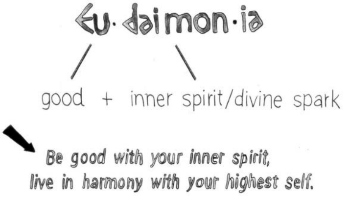

# Part 1 What is Stoicism?

> "If it is not right, do not do it, if it is not true, do not say it." —Marcus Aurelius

## Ch 1 The Promise of Stoic Philosophy

### Practice the Art of Living: Become a Warrior-Philosopher

> "First say to yourself what you would be; and then do what you have to do" —Epictetus

This practical "art of living" dimension of Stoicism holds two main promises: 
1. it teaches you how to live a happy and smoothly flowing life
2. it teaches you how to stay emotionally resilient to retain that happy and smoothly flowing life even in the face of adversity

#### Promise #1: Eudaimonia

